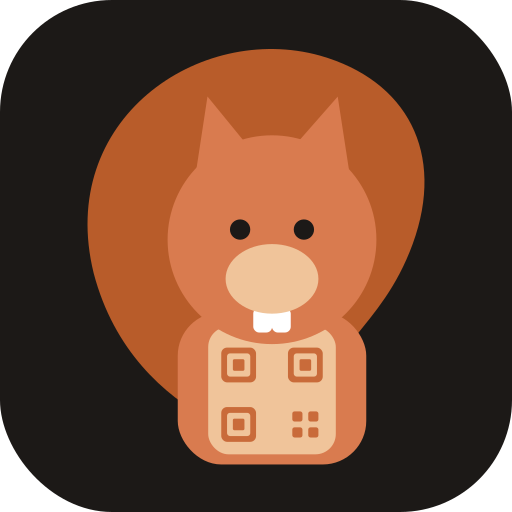

# Squrl



> DISCLAIMER: This is a heavily vibe-coded project created out of curiosity and necessity.

A cross-platform system tray utility that scans all connected displays for visible QR codes and copies their content to your clipboard.

## Features

- Sits in the system tray — no Dock icon (macOS) or taskbar window
- Scans all connected displays simultaneously
- Decodes multiple QR codes per screen
- Click any result to copy it to the clipboard
- Desktop notifications on scan completion

## Download

Pre-built binaries are available on the [Releases](https://github.com/thismarioperez/squrl/releases) page.

### macOS (Apple Silicon)

1. Download `squrl-<version>-darwin-arm64.tar.gz` from the release assets.

2. Extract the archive:

   ```sh
   tar -xzf squrl-<version>-darwin-arm64.tar.gz
   ```

3. Move the app to your Applications folder (optional but recommended):

   ```sh
   mv Squrl.app /Applications/
   ```

4. **Remove the macOS quarantine flag.**
   Because the app is not notarized, Gatekeeper will block it from opening. Run:

   ```sh
   xattr -dr com.apple.quarantine /Applications/Squrl.app
   ```

   Replace `/Applications/Squrl.app` with wherever you placed the bundle if you skipped step 3.

5. Open the app:

   ```sh
   open /Applications/Squrl.app
   ```

   On first launch, macOS will prompt you to grant **Screen Recording** permission. Approve it in:

   > System Settings → Privacy & Security → Screen Recording

   Then click the QR icon in the menu bar and select **Scan Screen**.

---

## Requirements

### All platforms

- [mise](https://mise.jdx.dev) for tooling management
- A C compiler (CGo is required by the screen capture and tray libraries)

### macOS

- macOS 10.15 Catalina or later (macOS 15 Sequoia supported)
- Xcode Command Line Tools: `xcode-select --install`

### Linux

- X11 display server
- GTK3 + libappindicator3 (for the system tray icon)
- libnotify / `notify-send` (for desktop notifications)
- `xclip` or `xsel` (for clipboard support)

### Windows

- CGo toolchain (e.g., [TDM-GCC](https://jmeubank.github.io/tdm-gcc/))

## Setup

Clone the repository and install the Go toolchain via mise:

```sh
git clone <repo-url> squrl
cd squrl
mise install
```

`mise install` reads `mise.toml` and installs Go 1.26 locally for this project.

## Running

### Option A — Build a `.app` bundle (macOS recommended)

This is the standard way to run the app on macOS. macOS grants Screen Recording permission to the `.app` bundle, so the permission prompt appears automatically on first scan.

```sh
mise run bundle
open "Squrl.app"
```

On first launch, macOS will prompt you to grant **Screen Recording** permission. Approve it in:

> System Settings → Privacy & Security → Screen Recording

Then click the QR icon in the menu bar and select **Scan Screen**.

### Option B — Run directly (all platforms / development)

```sh
mise run run
```

On macOS, when running outside of a `.app` bundle, the Screen Recording permission may be attached to **Terminal** (or your IDE) instead of the app itself.

## Build Tasks

All tasks are defined in `mise.toml` and run via `mise run <task>`.

| Task              | Description                      |
| ----------------- | -------------------------------- |
| `mise run build`  | Compile binary to `bin/squrl`    |
| `mise run bundle` | Build `Squrl.app` bundle (macOS) |
| `mise run run`    | Run directly without bundling    |
| `mise run test`   | Run all tests                    |
| `mise run tidy`   | Tidy Go module dependencies      |
| `mise run clean`  | Remove `bin/` and `Squrl.app`    |

## Usage

1. Launch the app (see above).
2. Click the QR icon in the system tray.
3. Click **Scan Screen** — the menu title changes to "Scanning…" while capture is in progress.
4. After scanning, decoded QR codes appear in the menu (up to 20 results).
5. Click any result to copy its full content to the clipboard.
6. A desktop notification confirms the copy.

## Screen Recording Permission (macOS)

macOS 10.15+ requires explicit Screen Recording permission for any app that captures the screen.

- **`.app` bundle**: permission is tied to `Squrl.app`. Grant once; macOS remembers it.
- **`go run` / terminal**: permission must be granted to Terminal, iTerm2, or whichever terminal emulator you use.

To revoke or re-grant permission: **System Settings → Privacy & Security → Screen Recording**.

## Icons

Icons are generated from SVG sources using `rsvg-convert` (from [librsvg](https://wiki.gnome.org/Projects/LibRsvg)) and the built-in `iconutil`.

| Source | Output | Purpose |
| --- | --- | --- |
| `assets/icon.svg` | `assets/AppIcon.icns` | macOS `.app` bundle icon |
| `assets/menubar.svg` | `assets/menubar_22.png`, `assets/menubar_44.png` | Menu bar template icon (1x and 2x/Retina) |

Install the dependency if you don't have it:

```sh
brew install librsvg
```

Regenerate all icon assets after any change to either SVG:

```sh
bash scripts/make-icns.sh
```

The generated files are committed to the repository so a rebuild is only needed when an icon changes.

## Project Structure

```
squrl/
├── cmd/squrl/main.go             # Entry point
├── internal/
│   ├── notify/
│   │   ├── notify_darwin.go      # macOS notifications (osascript)
│   │   ├── notify_linux.go       # Linux notifications (notify-send)
│   │   └── notify_windows.go     # Windows notifications (stub)
│   ├── scanner/
│   │   ├── scanner.go            # Screen capture + QR decoding
│   │   └── scanner_test.go
│   └── tray/
│       ├── tray.go               # System tray UI
│       └── tray_test.go
├── assets/
│   ├── icon.go                   # Embeds menubar PNG icons
│   ├── icon.svg                  # App bundle icon source (squirrel)
│   ├── menubar.svg               # Menu bar icon source
│   ├── menubar_22.png            # Menu bar icon 1x (generated)
│   ├── menubar_44.png            # Menu bar icon 2x/Retina (generated)
│   └── AppIcon.icns              # Generated macOS bundle icon
├── scripts/
│   ├── build-app.sh              # macOS .app bundle build script
│   ├── make-icns.sh              # SVG → .icns + menubar PNGs
│   └── release.sh                # Release build script
├── Info.plist                    # macOS app bundle metadata
├── mise.toml                     # Tooling + task definitions
├── go.mod
└── go.sum
```

## Dependencies

| Library                                                       | Purpose                                                          |
| ------------------------------------------------------------- | ---------------------------------------------------------------- |
| [`getlantern/systray`](https://github.com/getlantern/systray) | Cross-platform system tray icon and menu (macOS, Linux, Windows) |
| [`kbinani/screenshot`](https://github.com/kbinani/screenshot) | Cross-platform screen capture (macOS, Linux/X11, Windows)        |
| [`atotto/clipboard`](https://github.com/atotto/clipboard)     | Cross-platform clipboard write (macOS, Linux, Windows)           |
| [`makiuchi-d/gozxing`](https://github.com/makiuchi-d/gozxing) | QR code decoding (pure Go ZXing port)                            |
