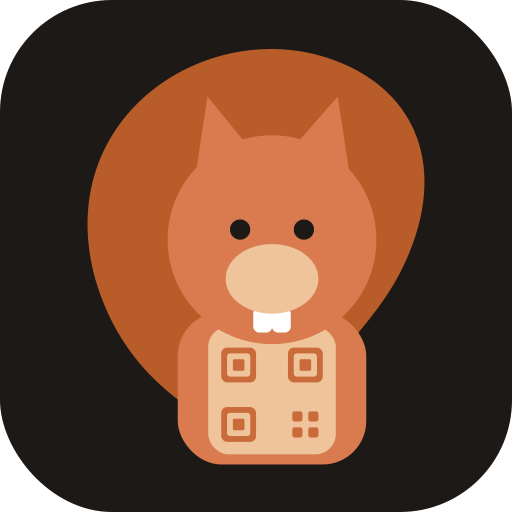

# Squrl



> DISCLAIMER: This is a heavily vibe-coded project created out of curiosity and necessity.

A cross-platform system tray utility that scans all connected displays for visible QR codes and copies their content to your clipboard.

## Features

- Sits in the system tray — no Dock icon (macOS) or taskbar window
- Scans all connected displays simultaneously
- Decodes multiple QR codes per screen
- Click any result to copy it to the clipboard
- Desktop notifications on scan completion (with click-to-focus on macOS when [alerter](https://github.com/vjeantet/alerter) is installed)

## Download

Pre-built binaries are available on the [Releases](https://github.com/thismarioperez/squrl/releases) page.

### macOS (Apple Silicon)

1. Download `squrl-<version>-darwin-arm64.tar.gz` from the release assets.

2. Extract the archive:

    ```sh
    tar -xzf squrl-<version>-darwin-arm64.tar.gz
    ```

3. Move the app to your Applications folder (optional but recommended):

    ```sh
    mv Squrl.app /Applications/
    ```

4. **Allow the app to open.**
   Because the app is not notarized, Gatekeeper will block it on first launch. Choose either method:

    **Option A — System Settings (no Terminal required):**
    - Try to open `Squrl.app`. macOS will show a "cannot be opened" alert — click **Done**.
    - Open **System Settings → Privacy & Security**, scroll to the bottom, and click **Open Anyway** next to the Squrl message.
    - Alternatively, right-click `Squrl.app` in Finder, choose **Open**, then click **Open** in the dialog.

    **Option B — Terminal:**

    ```sh
    xattr -dr com.apple.quarantine /Applications/Squrl.app
    ```

    Replace `/Applications/Squrl.app` with wherever you placed the bundle if you skipped step 3.

5. Open the app:

    ```sh
    open /Applications/Squrl.app
    ```

    On first launch, macOS will prompt you to grant **Screen Recording** permission. Approve it in:

    > System Settings → Privacy & Security → Screen Recording

    Then click the QR icon in the menu bar and select **Scan Screen**.

---

## Requirements

### All platforms

- [mise](https://mise.jdx.dev) for tooling management
- A C compiler (CGo is required by the screen capture and tray libraries)

### macOS

- macOS 10.15 Catalina or later (macOS 15 Sequoia supported)
- Xcode Command Line Tools: `xcode-select --install`
- [alerter v26.5](https://github.com/vjeantet/alerter/releases/tag/v26.5) _(optional)_ — enables click-to-focus on desktop notifications. Install the pinned version to match CI:

    ```sh
    curl -fsSL https://github.com/vjeantet/alerter/releases/download/v26.5/alerter-26.5.zip -o /tmp/alerter.zip
    echo "11f63cddc9bb3f8554ed9b762632a120cfa7bee05e3c09d65734823e09d24f10  /tmp/alerter.zip" | shasum -a 256 --check
    unzip -q /tmp/alerter.zip -d /tmp/alerter-bin
    sudo mv /tmp/alerter-bin/alerter /usr/local/bin/alerter
    ```

    When building a `.app` bundle (`mise run bundle`), alerter is automatically copied into the bundle if found in PATH — no separate install needed on end-user machines. When running the binary directly during development, alerter must be on your PATH for click detection to work.

### Linux

The following system packages are required. Run `mise run check-deps` to verify they are present, or `mise run run` / `mise run build` will check automatically.

| Package               | apt                            | Purpose                             |
| --------------------- | ------------------------------ | ----------------------------------- |
| pkg-config            | `pkg-config`                   | Locates C libraries at compile time |
| ayatana-appindicator3 | `libayatana-appindicator3-dev` | System tray (compile-time CGO dep)  |
| notify-send           | `libnotify-bin`                | Desktop notifications (runtime)     |
| xclip or xsel         | `xclip` / `xsel`               | Clipboard support (runtime)         |

Install all at once:

```sh
sudo apt-get install -y pkg-config libayatana-appindicator3-dev libnotify-bin xclip
```

An X11 display server is also required (Wayland via XWayland is supported).

### Windows

- CGo toolchain (e.g., [TDM-GCC](https://jmeubank.github.io/tdm-gcc/))

## Setup

Clone the repository and install the Go toolchain via mise:

```sh
git clone <repo-url> squrl
cd squrl
mise install
```

`mise install` reads `mise.toml` and installs Go 1.26 locally for this project.

## Running

### Option A — Build a `.app` bundle (macOS recommended)

This is the standard way to run the app on macOS. macOS grants Screen Recording permission to the `.app` bundle, so the permission prompt appears automatically on first scan.

```sh
mise run bundle
open "Squrl.app"
```

On first launch, macOS will prompt you to grant **Screen Recording** permission. Approve it in:

> System Settings → Privacy & Security → Screen Recording

Then click the QR icon in the menu bar and select **Scan Screen**.

### Option B — Build a dev bundle and run (macOS development)

Builds a `.app` bundle with `SQURL_DEBUG=1` and runs the binary directly (no separate `open` needed). Screen Recording permission is attached to `Squrl.app`, same as Option A.

```sh
mise run start-macos
```

### Option C — Run directly (Linux / all platforms)

This is the **recommended development workflow on Linux**. It also works on macOS and Windows for quick runs without bundling.

**VS Code:** open the Command Palette → **Tasks: Run Task** → **`mise: start`**. This is set as the default run task. Output (including debug logs) appears in the Terminal panel.

**Terminal:**

```sh
mise run start
```

On macOS, when running outside of a `.app` bundle, the Screen Recording permission may be attached to **Terminal** (or your IDE) instead of the app itself.

## Build Tasks

All tasks are defined in `mise.toml` and run via `mise run <task>`.

| Task                   | Description                                                                                                          |
| ---------------------- | -------------------------------------------------------------------------------------------------------------------- |
| `mise run build`       | Compile binary to `bin/squrl`. Extra args forwarded to `go build` (e.g. `-race`)                                     |
| `mise run bundle`      | Clean then build `Squrl.app` bundle (macOS). Pass `debug` for a debug build (no optimisations)                       |
| `mise run start`       | Run directly without bundling (`SQURL_DEBUG=1`). **Primary debug method on Linux.** Extra args forwarded to `go run` |
| `mise run start-macos` | Build dev bundle and run `Squrl.app` directly (macOS, `SQURL_DEBUG=1`)                                               |
| `mise run debug-macos` | Build debug bundle (no optimisations) and launch `dlv exec` (macOS)                                                  |
| `mise run test`        | Run all tests. Extra args forwarded to `go test` (e.g. `-run TestFoo -v`)                                            |
| `mise run tidy`        | Tidy Go module dependencies                                                                                          |
| `mise run clean`       | Remove `bin/` and `Squrl.app`                                                                                        |

## Debugging

`SQURL_DEBUG=1` enables structured debug logging. Logs are written to a platform-specific file **and** mirrored to stderr simultaneously, so they appear directly in the terminal or VS Code panel.

Log file locations:

| Platform | Path                             |
| -------- | -------------------------------- |
| macOS    | `~/Library/Logs/squrl/squrl.log` |
| Linux    | `~/.local/share/squrl/squrl.log` |
| Windows  | `%APPDATA%\squrl\squrl.log`      |

The log captures: display count, per-display capture errors, QR decode results, scan errors, notification dispatch, alerter path resolution, and clipboard failures.

### Linux

The recommended development workflow on Linux is the **`mise: start`** VS Code task, or equivalently `mise run start` in a terminal. It runs the app directly via `go run` with `SQURL_DEBUG=1` — no binary to build and no debugger to attach. Logs stream live to the terminal output.

**VS Code:** open the Command Palette → **Tasks: Run Task** → **`mise: start`**. Output (including debug logs) appears in the Terminal panel.

**Terminal:**

```sh
mise run start
```

To tail the log file separately (e.g. to keep it visible while the app is backgrounded):

```sh
tail -f ~/.local/share/squrl/squrl.log
```

> **Note:** Interactive breakpoint debugging via delve is not supported on Linux. The Wayland screenshot portal used for screen capture does not respond reliably when the process is under ptrace, preventing scans from completing inside a dlv session.

### macOS

Two VS Code launch configurations are provided in `.vscode/launch.json`, backed by build tasks in `.vscode/tasks.json`:

**Debug squrl (macOS)** — runs the `mise: bundle debug` preLaunchTask (`mise run bundle debug`, builds with `-gcflags "all=-N -l"`, no optimisations), then attaches delve to `Squrl.app/Contents/MacOS/squrl` with `SQURL_DEBUG=1`. Use this for day-to-day breakpoint debugging.

**Debug squrl (macOS, pre-built)** — attaches delve to an already-built `Squrl.app/Contents/MacOS/squrl` with `SQURL_DEBUG=1`, skipping the build step. Use this when the bundle is already present.

To pre-build the debug bundle from the terminal and then attach VS Code:

```sh
# Build the debug bundle (no optimisations) and drop into a dlv REPL
mise run debug-macos

# — or just build without launching dlv, then use VS Code to attach —
mise run bundle debug
# Launch via VS Code: Run & Debug → "Debug squrl (macOS, pre-built)"
```

> **macOS note:** Screen Recording permission is tied to the binary path. Both configs target `Squrl.app/Contents/MacOS/squrl`, so macOS prompts once for that path and remembers it across rebuilds.

## Usage

1. Launch the app (see above).
2. Click the QR icon in the system tray.
3. Click **Scan Screen** — the menu title changes to "Scanning…" while capture is in progress.
4. After scanning, decoded QR codes appear in the menu (up to 20 results).
5. Click any result to copy its full content to the clipboard.
6. A desktop notification confirms the copy.

## Screen Recording Permission (macOS)

macOS 10.15+ requires explicit Screen Recording permission for any app that captures the screen.

- **`.app` bundle**: permission is tied to `Squrl.app`. Grant once; macOS remembers it.
- **`go run` / terminal**: permission must be granted to Terminal, iTerm2, or whichever terminal emulator you use.

To revoke or re-grant permission: **System Settings → Privacy & Security → Screen Recording**.

## Icons

Icons are generated from SVG sources using `rsvg-convert` (from [librsvg](https://wiki.gnome.org/Projects/LibRsvg)) and the built-in `iconutil`.

| Source                    | Output                                           | Purpose                                          |
| ------------------------- | ------------------------------------------------ | ------------------------------------------------ |
| `assets/icon.svg`         | `assets/AppIcon.icns`                            | macOS `.app` bundle icon                         |
| `assets/menubar.svg`      | `assets/menubar_22.png`, `assets/menubar_44.png` | Menu bar template icon (1x and 2x/Retina)        |
| `assets/notification.svg` | `assets/notification_64.png`                     | Desktop notification icon (64×64, all platforms) |

Install the dependency if you don't have it:

```sh
brew install librsvg
```

Regenerate all icon assets after any change to either SVG:

```sh
bash scripts/make-icns.sh
```

The generated files are committed to the repository so a rebuild is only needed when an icon changes.

## Project Structure

```
squrl/
├── cmd/squrl/main.go             # Entry point
├── internal/
│   ├── logging/
│   │   └── logging.go            # Structured logging (slog); enable via SQURL_DEBUG=1
│   ├── notify/
│   │   ├── notify_darwin.go      # macOS notifications (alerter with osascript fallback)
│   │   ├── notify_linux.go       # Linux notifications (notify-send)
│   │   ├── notify_unix.go        # Shared darwin/linux: writes notification icon to temp file
│   │   ├── notify_unix_test.go
│   │   └── notify_windows.go     # Windows notifications (stub)
│   ├── scanner/
│   │   ├── scanner.go            # Screen capture + QR decoding
│   │   └── scanner_test.go
│   └── tray/
│       ├── menu_darwin.go        # macOS: opens tray menu on notification click (CGo/ObjC)
│       ├── menu_linux.go         # Linux: no-op stub
│       ├── menu_windows.go       # Windows: no-op stub
│       ├── tray.go               # System tray UI
│       └── tray_test.go
├── assets/
│   ├── icon.go                   # Embeds menubar and notification PNG icons
│   ├── icon.svg                  # App bundle icon source (squirrel)
│   ├── menubar.svg               # Menu bar icon source
│   ├── menubar_22.png            # Menu bar icon 1x (generated)
│   ├── menubar_44.png            # Menu bar icon 2x/Retina (generated)
│   ├── notification.svg          # Desktop notification icon source
│   ├── notification_64.png       # Desktop notification icon 64×64 (generated)
│   └── AppIcon.icns              # Generated macOS bundle icon
├── scripts/
│   ├── build-app.sh              # macOS .app bundle build script
│   ├── make-icns.sh              # SVG → .icns + menubar PNGs
│   └── release.sh                # Release build script
├── .vscode/
│   ├── launch.json               # VS Code delve debug launch configurations (macOS only)
│   └── tasks.json                # VS Code mise-backed tasks (build, bundle, bundle debug, test, clean)
├── Info.plist                    # macOS app bundle metadata
├── mise.toml                     # Tooling + task definitions
├── go.mod
└── go.sum
```

## Dependencies

| Library                                                       | Purpose                                                          |
| ------------------------------------------------------------- | ---------------------------------------------------------------- |
| [`getlantern/systray`](https://github.com/getlantern/systray) | Cross-platform system tray icon and menu (macOS, Linux, Windows) |
| [`kbinani/screenshot`](https://github.com/kbinani/screenshot) | Cross-platform screen capture (macOS, Linux/X11, Windows)        |
| [`atotto/clipboard`](https://github.com/atotto/clipboard)     | Cross-platform clipboard write (macOS, Linux, Windows)           |
| [`makiuchi-d/gozxing`](https://github.com/makiuchi-d/gozxing) | QR code decoding (pure Go ZXing port)                            |

## License

Squrl is released under the [MIT License](LICENSE).
